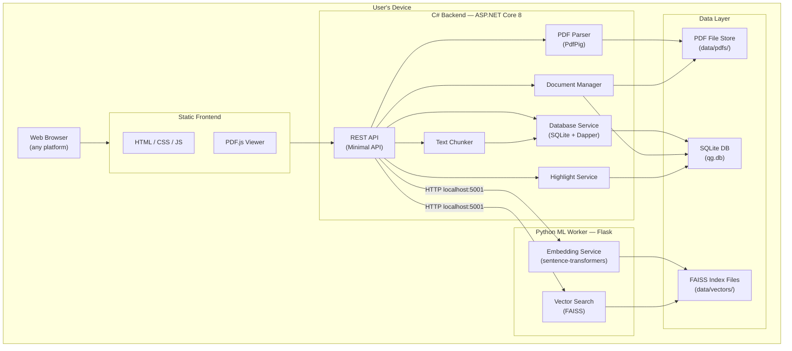
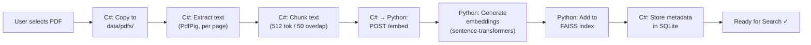
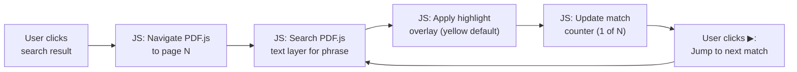

# QuickGuide (QG) — Architecture Document

**Version:** 1.0
**Date:** 2026-03-05

---

## 1 High-Level Architecture



## 2 Data-Flow Pipeline

### 2.1 Ingestion Flow



### 2.2 Search Flow

```mermaid
flowchart LR
    A["User types query"] --> B["C# API receives<br/>search request"]
    B --> C["C# → Python:<br/>POST /search"]
    C --> D["Python: Embed query<br/>(sentence-transformers)"]
    D --> E["Python: FAISS ANN<br/>search (cosine sim)"]
    E --> F["Python returns<br/>top-K chunk IDs + scores"]
    F --> G["C#: Fetch chunk text<br/>from SQLite"]
    G --> H["C# returns JSON<br/>results to browser"]
    H --> I["Browser: Navigate<br/>PDF.js + Highlight"]
```



### 2.3 Navigation & Highlighting Flow



## 3 Component Breakdown

### 3.1 C# Backend (ASP.NET Core 8 Minimal API)

| File | Responsibility |
|---|---|
| `Program.cs` | App entry point, DI registration, route mapping, static file serving |
| `Services/PdfParserService.cs` | PdfPig text extraction — extracts text per page with character positions |
| `Services/TextChunkerService.cs` | Splits page text into overlapping token-windowed chunks |
| `Services/DocumentService.cs` | Document lifecycle: upload, list, delete, status tracking |
| `Services/SearchService.cs` | Orchestrates search: calls Python worker, merges with SQLite metadata |
| `Services/HighlightService.cs` | Highlight CRUD: create, read, update color, delete |
| `Services/PythonBridgeService.cs` | HTTP client that communicates with the Python ML worker |
| `Data/DatabaseService.cs` | SQLite connection, migrations, Dapper queries |
| `Models/` | C# record types for API requests/responses and DB entities |

### 3.2 Python ML Worker (Flask)

| File | Responsibility |
|---|---|
| `worker.py` | Flask app: `/embed`, `/search`, `/health` endpoints |
| `embedder.py` | Loads `all-MiniLM-L6-v2`, generates 384-dim embeddings |
| `vector_store.py` | FAISS index management: add vectors, search, save/load, delete |

### 3.3 Frontend (HTML / CSS / Vanilla JS)

| File | Responsibility |
|---|---|
| `index.html` | App shell — layout, PDF viewer container, search panel |
| `css/app.css` | Cozy design system — warm colors, rounded corners, soft shadows |
| `js/app.js` | API calls, search orchestration, state management, document selector |
| `js/pdfviewer.js` | PDF.js rendering, page navigation, text-layer highlight overlays, match jumping |

### 3.4 Data Layer

| Store | Technology | Contents |
|---|---|---|
| `data/qg.db` | SQLite | Documents, text chunks, highlights, settings |
| `data/vectors/` | FAISS index files | Embedding vectors per document (`.faiss` + `.map`) |
| `data/pdfs/` | File system | Original PDF files copied from user selections |

## 4 API Endpoints (C# Backend — port 8080)

| Method | Path | Description |
|---|---|---|
| `GET` | `/` | Serve `index.html` |
| `POST` | `/api/documents/upload` | Upload + ingest PDF |
| `GET` | `/api/documents` | List all documents |
| `GET` | `/api/documents/{id}` | Get document details |
| `GET` | `/api/documents/{id}/status` | Get ingestion progress |
| `DELETE` | `/api/documents/{id}` | Delete document + data |
| `GET` | `/api/documents/{id}/pdf` | Serve PDF file for viewer |
| `POST` | `/api/search` | Semantic search (proxies to Python) |
| `POST` | `/api/highlights` | Add a highlight |
| `GET` | `/api/documents/{id}/highlights` | Get highlights for a document |
| `PUT` | `/api/highlights/{id}` | Update highlight color |
| `DELETE` | `/api/highlights/{id}` | Delete a highlight |

## 5 Python Worker API (port 5001)

| Method | Path | Description |
|---|---|---|
| `GET` | `/health` | Health check + model status |
| `POST` | `/embed` | Generate embeddings for text chunks |
| `POST` | `/search` | Embed query + FAISS search → return chunk IDs + scores |
| `POST` | `/index/add` | Add vectors to a document's FAISS index |
| `POST` | `/index/delete` | Delete a document's FAISS index |

## 6 Inter-Process Communication

```
┌─────────────────────────────────┐     HTTP (localhost:5001)     ┌───────────────────────────┐
│  C# Backend (ASP.NET Core)     │ ──────────────────────────► │  Python Worker (Flask)     │
│  Port 8080                      │ ◄────────────────────────── │  Port 5001                │
│                                 │         JSON payloads        │                           │
│  • PDF parsing (PdfPig)         │                              │  • sentence-transformers  │
│  • Text chunking                │                              │  • FAISS index management │
│  • SQLite database              │                              │                           │
│  • File management              │                              │                           │
│  • Static file serving          │                              │                           │
└─────────────────────────────────┘                              └───────────────────────────┘
```

The C# backend **launches the Python worker** as a subprocess on startup and shuts it down on exit. Communication uses simple HTTP/JSON on localhost — no sockets, no message queues.

## 7 Key Design Decisions

| Decision | Rationale |
|---|---|
| **C# primary, Python secondary** | User requested C# for speed; Python only for ML tasks that lack C# equivalents |
| **ASP.NET Core Minimal API** | Less boilerplate than controllers; fast startup; built-in DI |
| **PdfPig over iTextSharp** | Pure C#, MIT licensed, good text extraction, no Java dependency |
| **Separate Python process** | Clean separation of concerns; C# backend stays fast; Python handles ML |
| **Flask over FastAPI (worker)** | Simpler for a small internal service; no async needed for batch embedding |
| **FAISS over custom ANN** | Battle-tested, optimized C++ core, excellent Python bindings |
| **SQLite over Postgres** | Zero install; single-file DB; perfect for local-first app |
| **PDF.js over native viewer** | Works in every browser; supports text-layer highlighting |
| **Vanilla JS over React** | Zero build step; served as static files; the app is simple enough |
