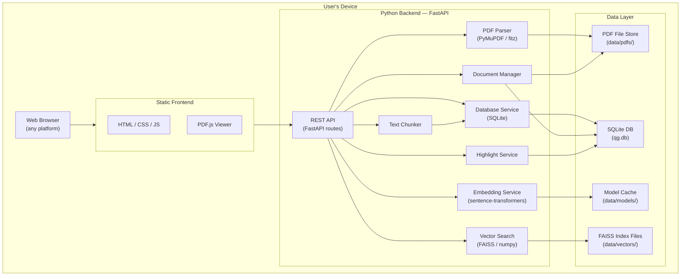

# QuickGuide (QG) — Architecture Document

**Version:** 1.1
**Date:** 2026-03-05

---

## 1 High-Level Architecture

## 2 Data-Flow Pipeline

### 2.1 Ingestion Flow

### 2.2 Search Flow

```mermaid
flowchart LR
    A["User types query"] --> B["FastAPI API receives<br/>search request"]
    B --> C["sentence-transformers:<br/>Embed query (384-dim)"]
    C --> D["FAISS (or numpy):<br/>ANN search (cosine sim)"]
    D --> E["Filter results:<br/>similarity ≥ 0.30"]
    E --> F["SQLite: Fetch<br/>chunk text + page numbers"]
    F --> G["FastAPI returns<br/>JSON results to browser"]
    G --> H["Browser: Navigate<br/>PDF.js + Highlight"]
```

### 2.3 Navigation & Highlighting Flow

## 3 Component Breakdown

### 3.1 Python Backend (FastAPI — single process, port 8080)

| File | Responsibility |
|---|---|
| `src/main.py` | App entry point, FastAPI routes, static file serving, browser auto-launch |
| `src/config.py` | All configuration: paths, server settings, model params, search thresholds |
| `src/models.py` | Pydantic request/response models (SearchRequest, HighlightCreate, etc.) |
| `src/database.py` | SQLite connection (thread-local, WAL mode), schema init, CRUD queries |
| `src/services/pdf_parser.py` | PyMuPDF text extraction per page; bounding-box search for highlighting |
| `src/services/chunker.py` | Splits page text into overlapping 512-token windows with 50-token overlap |
| `src/services/embedder.py` | Lazy-loads `all-MiniLM-L6-v2`; batch encodes text; normalizes to float32 |
| `src/services/vector_store.py` | Per-document FAISS index (or numpy fallback); add, search, save, load, delete |
| `src/services/search.py` | Semantic search orchestration: embed → vector search → filter → enrich |
| `src/services/documents.py` | Document lifecycle: upload, ingest pipeline, list, get, delete, progress tracking |
| `src/services/highlights.py` | Highlight CRUD: add, get, update color, delete |

### 3.2 Frontend (HTML / CSS / Vanilla JS)

| File | Responsibility |
|---|---|
| `src/static/index.html` | App shell — layout, PDF viewer container, search panel, highlights tab |
| `src/static/css/app.css` | Cozy design system — warm colors, rounded corners, soft shadows |
| `src/static/js/app.js` | API calls, search orchestration, PDF.js integration, state management, highlights |
| `src/static/img/qg-favicon.svg` | QG logo used as favicon and launcher icon |

### 3.3 Data Layer

| Store | Technology | Contents |
|---|---|---|
| `data/qg.db` | SQLite | Documents, text chunks, highlights |
| `data/vectors/` | FAISS index files | Embedding vectors per document (`.faiss` + `.map`, or `.npy` fallback) |
| `data/pdfs/` | File system | Original PDF files copied from user selections |
| `data/models/` | File system cache | Downloaded `all-MiniLM-L6-v2` model (~80 MB, cached after first run) |

## 4 API Endpoints (FastAPI Backend — port 8080)

| Method | Path | Description |
|---|---|---|
| `GET` | `/` | Serve `index.html` |
| `POST` | `/api/documents/upload` | Upload + ingest PDF |
| `GET` | `/api/documents` | List all documents |
| `GET` | `/api/documents/{id}` | Get document details |
| `GET` | `/api/documents/{id}/status` | Get ingestion progress |
| `DELETE` | `/api/documents/{id}` | Delete document + all associated data |
| `GET` | `/api/documents/{id}/pdf` | Serve PDF file for viewer |
| `GET` | `/api/documents/{id}/text-positions` | Search text on a page; returns bounding-box rects for precise highlighting |
| `POST` | `/api/search` | Semantic search (embed + FAISS + SQLite enrichment) |
| `POST` | `/api/highlights` | Add a highlight annotation |
| `GET` | `/api/documents/{id}/highlights` | Get highlights for a document (optional `?page=N` filter) |
| `PUT` | `/api/highlights/{id}` | Update highlight color |
| `DELETE` | `/api/highlights/{id}` | Delete a highlight |

## 5 Key Design Decisions

| Decision | Rationale |
|---|---|
| **Python single-process** | All logic — PDF parsing, API, database, embeddings, vector search — runs in one FastAPI process; no inter-process complexity |
| **FastAPI over Flask** | Async-native, built-in Pydantic validation, automatic OpenAPI docs, faster than Flask |
| **PyMuPDF over PdfPig** | Python-native, fast C++ core, returns character-level positions needed for highlight overlays |
| **sentence-transformers in-process** | Direct function calls instead of HTTP round-trips; simpler, lower latency |
| **FAISS over custom ANN** | Battle-tested, optimized C++ core, excellent Python bindings; numpy fallback ensures compatibility |
| **SQLite over Postgres** | Zero install; single-file DB; perfect for local-first app |
| **PDF.js over native viewer** | Works in every browser; supports text-layer highlighting |
| **Vanilla JS over React** | Zero build step; served as static files; the app is simple enough |
| **Thread-local SQLite connections** | Avoids connection sharing across threads; WAL mode allows concurrent reads during writes |
