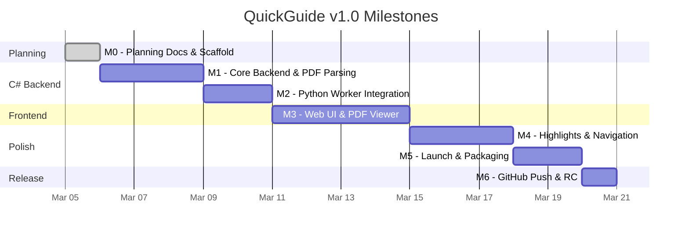

# QuickGuide (QG) — Scope Lock & Milestones

**Version:** 1.0
**Date:** 2026-03-05

---

## 1 Scope Boundary

### In Scope (v1.0)
- Local PDF selection from file system, parsing, and managed storage
- Text extraction (PdfPig, C#) and vector embedding (sentence-transformers, Python)
- Semantic natural-language search via prompt box
- Search result → one-click page navigation in PDF.js viewer
- Auto-highlight matching phrases (yellow default)
- **Multi-match navigation** — jump between all highlighted sections (▶/◀)
- Customizable highlight color (color picker + presets)
- Persistent highlights saved across sessions
- Multi-document library (upload, select, delete)
- Responsive layout (desktop side-by-side, mobile stacked)
- Cozy, layman-friendly UI design
- QG logo desktop launcher (`.bat` / `.sh`)
- Cross-platform via web browser (Windows, macOS, Linux, mobile)
- Push to GitHub (`Ethan_da_Tech_Wizard/Quick_Guide`)

### Out of Scope (v1.0)
- OCR for scanned/image-only PDFs
- Cloud sync or multi-device sharing
- Multi-user authentication
- Internet-connected LLM (ChatGPT, etc.)
- Native mobile apps (App Store / Play Store)
- Annotation/highlight export to PDF
- Search history persistence

---

## 2 Milestones

### M0 — Planning & Scaffold ✅
All 8 planning documents finalized. Repository scaffolded with folder structure.

### M1 — Core C# Backend
**Deliverables:** ASP.NET Core project, PdfPig text extraction, text chunking, SQLite database, document CRUD API, static file serving.
**Definition of Done:** Upload a PDF via API → text extracted and chunks stored in SQLite.

### M2 — Python Worker Integration
**Deliverables:** Python Flask worker, sentence-transformers embedding, FAISS index, C#→Python bridge service.
**DoD:** C# backend calls Python worker → embeddings generated → stored in FAISS.

### M3 — Web UI & PDF Viewer
**Deliverables:** `index.html` with cozy UI, document selector, search prompt box, results list, PDF.js viewer, responsive layout.
**DoD:** User can select a document, type a query, see results, and view the PDF in-browser.

### M4 — Highlights & Multi-Match Navigation
**Deliverables:** Click-to-navigate, auto-highlight, multi-match jumping (▶/◀), color picker, persistent highlights.
**DoD:** Full flow: query → results → click → PDF navigates → phrase highlighted → jump between matches.

### M5 — Launch & Packaging
**Deliverables:** `qg.bat` / `qg.sh` launcher scripts, QG logo, README/quickstart guide, `.gitignore`.
**DoD:** Double-click `qg.bat` → backend starts → browser opens → app is usable.

### M6 — GitHub Release
**Deliverables:** `git init`, commit, push to `Ethan_da_Tech_Wizard/Quick_Guide`.
**DoD:** Repository is public on GitHub with README, docs, and working code.

---

## 3 Change Control

Any feature addition beyond the "In Scope" list requires:
1. Impact assessment against existing milestones.
2. Explicit approval documented in a change log.
3. Updated risk register if applicable.

This prevents scope creep and ensures v1.0 ships on time.
